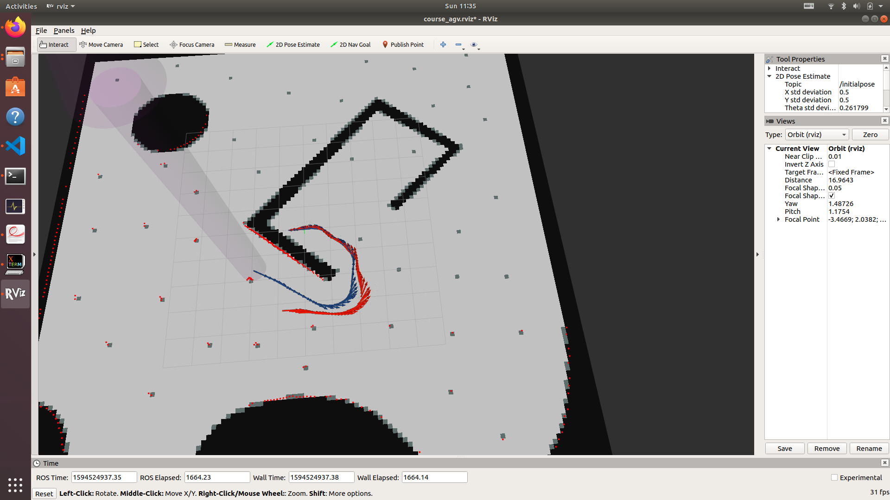
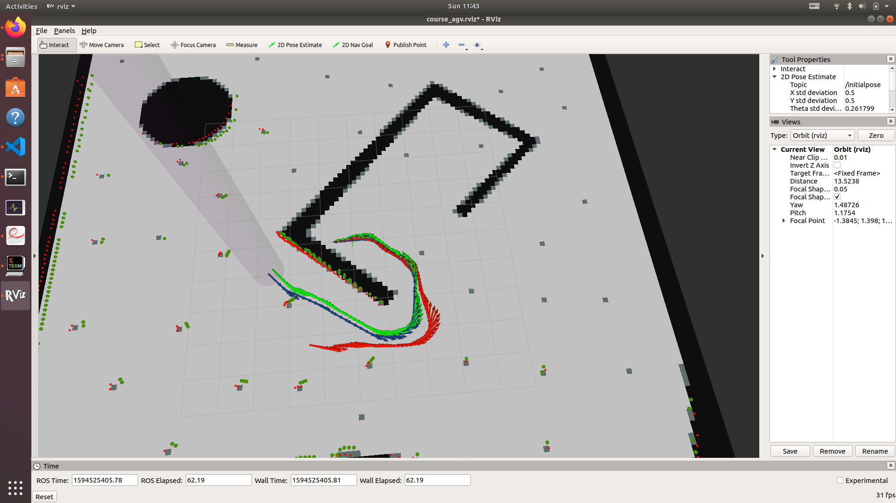

# Installation

## System Requirements

Ubuntu 18.04 LTS or newer
A graphics card is suggested when using laser rays. 

The test cases are passed on 
* Native Ubuntu 18.04LTS
* Intel i5 8250U(4c8t) Processor
* 8G RAM


## Package Requirements
* ros-melodic `sudo apt install ros-melodic-full`
* python 2.x
* pynput (pip/conda)
* matplotlib
* numpy
* catkin_make
* build-essentials
* gazebo

## Building the Source Code

```bash
catkin_make
source ~/catkin_ws/devel/setup.bash
```

## Launching

### Global Path Planning
### 全局路径规划

```bash
roslaunch course_agv_nav nav.launch
```
### Path Tracking/Local Planning 
### 路径跟踪/局部规划

```bash
roslaunch course_agv_nav nav.launch
# In another terminal
rosrun course_agv_nav <DWA.py|path_tracking.py|stupid_tracking.py>
```

| Script             | Description                                            |
| ------------------ | ------------------------------------------------------ |
| DWA.py             | DWA(Dynamic Window Algorithm) local planner 动态窗口法 |
| path_tracking.py   | Graceful Controlling Algorithm 优雅控制算法            |
| stupid_tracking.py | Linear Controlling Method 线性控制律                   |

### ICP(Iterative Closest Point) Odometry 
### 激光ICP里程计

```bash
roslaunch course_agv_slam icp.launch
```

Using rosbag to pre-recorded data and check the result:

```bash
# In another terminal
rosbag play --clock [--rate=4] xxx.bag
```

Some bag has 120 laser rays, while others has 300 laser rays.

Improved efficiency of ICP allows up to 4x rate of playing speed in 300 rays scenario. Depending on the hardware and system, the processing power may vary. Turn down the playing rate if 4x is too high for your hardware.



Note that there's also a wheel odometry (denoted by blue arrows) for standard reference. The ICP Odometry is denoted by red arrows.

Or you can launch gazebo and see the result.

### EKF(Extended Karman Filter) Based on Laser ICP
### 基于激光ICP的扩展卡尔曼滤波定位

```bash
roslaunch course_agv_slam localization.launch
# In another terminal
rosbag play --clock [--rate=4] xxx.bag
```




A series of light green arrows are added, representing the EKF localizing result; Green laser dots represent the simulated laser sensor.

### EKF Based on Landmarks
### 基于特征识别的扩展卡尔曼滤波定位

```bash
roslaunch course_agv_slam localization_lm.launch
# In another terminal
rosbag play --clock [--rate=4] xxx.bag
```

Note that the script can't identify the landmarks properly when using 120 rays of laser.

### EKF-SLAM(Simultaneously Localization and Mapping)
### 扩展卡尔曼滤波 同时定位与地图构建

```bash
roslaunch course_agv_slam slam.launch
# In another terminal
rosbag play --clock [--rate=4] xxx.bag
```

Like EKF Based on Landmarks, the system cannot work properly under 120 rays of laser.

### Mapping
### 栅格地图构建

```bash
roslaunch course_agv_slam mapping.launch
# In another terminal
rosbag play --clock [--rate=4] xxx.bag
```

By default the `mapping.launch` use `mapping_add.py` for mapping and `slam.launch` for localization.

Or you can change the mapping nodes according to your need:

| Script           | Description                                            |
| ---------------- | ------------------------------------------------------ |
| mapping.py       | Simplest 1/0 mapping. 最简单的透射为0，反射为1         |
| mapping_add.py   | 加法方法，透射概率减小一个定值，反射概率增大一个定值   |
| bayes_mapping.py | Use Bayes odds updating formula 贝叶斯对数概率更新公式 |

In addition, you can adjust your localizing node by changing the included launch file, **DON'T FORGET** to change parameter `mapping/frame_name` for mapping!

| launch file            | Description                             | `mapping/frame_name` |
| ---------------------- | --------------------------------------- | -------------------- |
| slam.launch            | EKF-SLAM 扩展卡曼滤波同时定位与地图构建 | slam_ekf             |
| localization_lm.launch | EKF-Landmark 扩展卡曼滤波特征定位       | ekf_icp              |
| localiztion.launch     | EKF 基于激光里程计的扩展卡曼滤波定位    | ekf_icp              |
