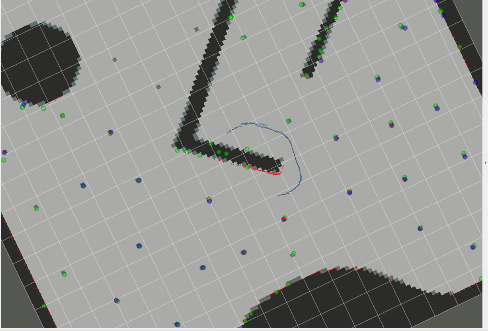

# EKF SLAM

本次实验需要的文件：

* 提取激光特征 - extraction.py

* 激光里程计 - icp.py

* ekf算法 - ekf_lm.py  (TODO)

* slam - slam_ekf.py

ekf_lm.py TODO：

* 完成estimate整个过程，包括预测和更新
* 完成jacob_motion以及jacob_h
* 完成odom_model（与之前实现的ekf应该相同）
* 完成search_correspond_landmark_id
  * 若为新lm则返回new id