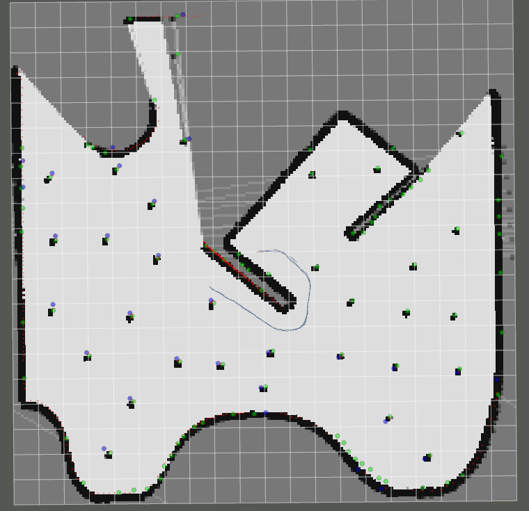
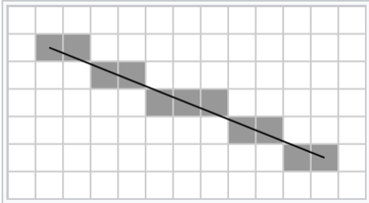

# mapping

在上节课ekf_slam的基础上增加mapping作为slam_ekf.py的模块进行调用

* rviz中再添加一个map消息 订阅`/slam_map`，设置透明度

* 补充`slam_ekf.py`中的TODO（mapping过程）

* 填写`mapping.py`中的update函数：
  * 参数为ox,oy,center_x,center_y
  * 可以考虑使用bresenham方法完成激光对应的线段更新

* 其他参考资料：
  * [nav_msgs/OccupancyGrid.msg](http://docs.ros.org/kinetic/api/nav_msgs/html/msg/OccupancyGrid.html)
  * [bresenham line algorithm wikipedia](https://en.wikipedia.org/wiki/Bresenham%27s_line_algorithm)
* 目前程序的小问题和待改进：
  * 由于mapping是预先设置好的长宽，所以直接计算出来的ox，oy可以会导致pmap索引越界
  * laser的inf未进行处理
  * 贝叶斯更新