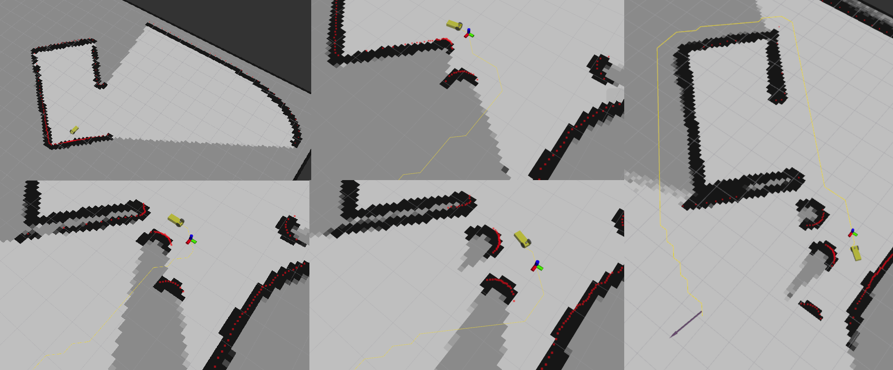
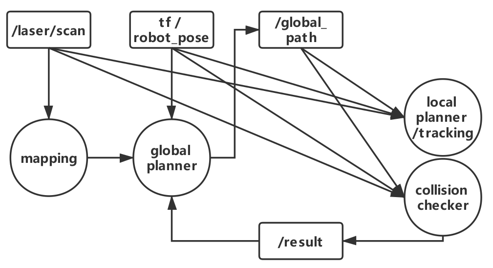

# replan

* global planner:
  * 接受mapping来的update map 根据result进行重规划
* collision checker:
  * 根据global path以及laser信息，判断目前的规划是否会有碰撞，是否需要重规划
  * 填写collision_check函数:`##TODO` tag
* mapping模块-> mapping ros node
* 在rviz上添加mapping信息，进行查看