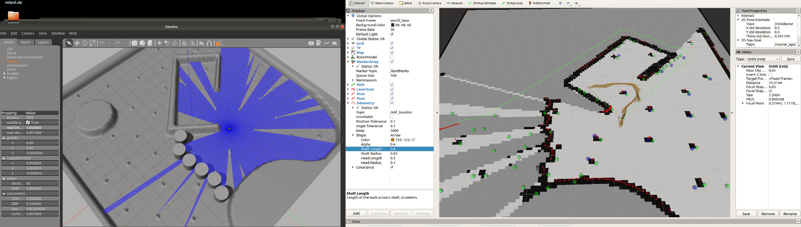

# one for all

* navigation
  * global planner
  * local planner
  * replan
* mapping
* localization

* gazebo 慢速 physics - real time / step time
* local planner 规划频率
* 无效landmarks过多，拉慢运行速度
  * 从地图获取lm
  * 调整extraction
* 激光打到地面，localization跑飞
* 激光是否需要滤波？
  * 障碍物情况
  * 1604-cpu laser的bug