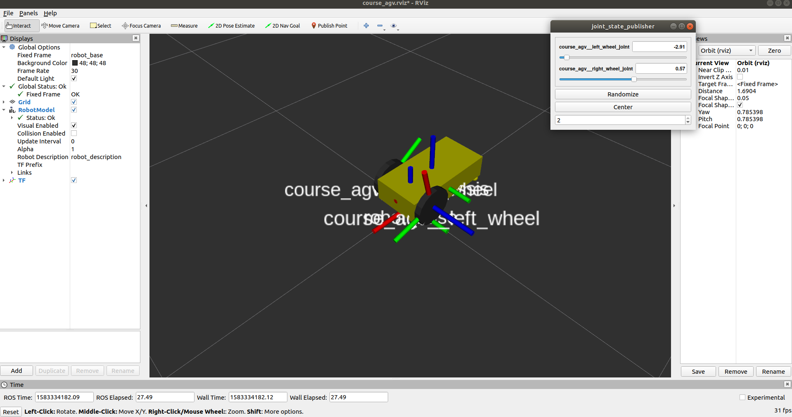
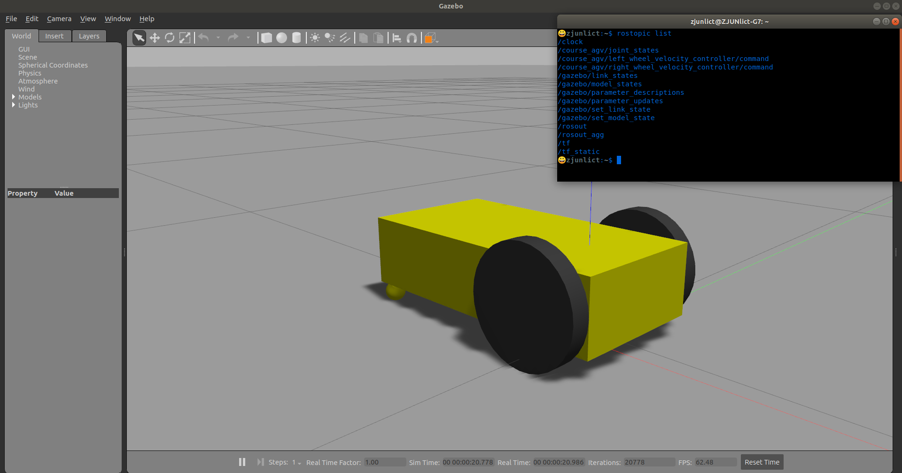

# URDF, joint control and gazebo

>  目标：使用urdf在gazebo中构建双轮差动机器人，使其正确显示并通过ros node可以控制轮子速度

```bash
apt-get install ros-melodic-joint-state-publisher-gui ros-melodic-joint-state-controller ros-melodic-controller-manager ros-melodic-gazebo-ros-pkgs ros-melodic-gazebo-ros-control 
```

本节推荐package以及细节文件结构请参考task/c2

```bash
src
├── course_agv_control
│   ├── CMakeLists.txt
│   ├── config
│   │   └── course_agv_control.yaml
│   ├── launch
│   │   └── course_agv_control.launch
│   ├── scripts
│   │   ├── keyboard_command.py  # 键盘控制
│   │   └── kinematics.py        # 运动学分解
│   └── package.xml
├── course_agv_description
│   ├── CMakeLists.txt
│   ├── launch
│   │   ├── course_agv.rviz
│   │   └── course_agv_rviz.launch
│   ├── package.xml
│   └── urdf
│       ├── course_agv.gazebo
│       ├── course_agv.xacro
│       └── materials.xacro
└── course_agv_gazebo
    ├── CMakeLists.txt
    ├── launch
    │   └── course_agv_world.launch
    └── package.xml
```
 主要要写这两个有注释的


## 在rviz上检查你的机器人模型

* Universal Robotic Description Format (urdf)
  * link : collision & visual
  * joint : type & limits
* urdf & xacro
  * `gazebo` tag in xacro
  * `transmission` tag in xacro
* node robot_state_publisher : **`tf`**
* node joint_state_publisher

> 运行以下命令查看效果
> `roslaunch course_agv_description course_agv_rviz.launch`



## 在gazebo中运行，并添加controller

* gazebo args
* node : gazebo_ros spawn_model

> 运行以下命令查看效果
> `roslaunch course_agv_gazebo course_agv_world.launch`



## 编写运动学分解程序并下发速度

* `local_velocity` to `wheel velocity`

---
urdf工具：

- xmllint
- check_urdf

参考：

1.[Using roslaunch to start Gazebo, world files and URDF models](http://gazebosim.org/tutorials?tut=ros_roslaunch&cat=connect_ros)

2.[Using a URDF in Gazebo](http://gazebosim.org/tutorials/?tut=ros_urdf)

3.[ROS Control in Gazebo](http://gazebosim.org/tutorials/?tut=ros_control)

4.[Building a Visual Robot Model with URDF from Scratch](http://wiki.ros.org/urdf/Tutorials/Building%20a%20Visual%20Robot%20Model%20with%20URDF%20from%20Scratch)

5.[rrbot gazebo demo](https://github.com/ros-simulation/gazebo_ros_demos)
