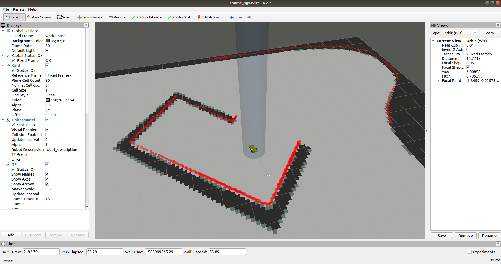

# tf, sensors and rviz

> 1.在gazebo中载入地图，在urdf中添加sensor，可以读取laser以及imu数据
>
> 2.添加tf，使rviz可以显示完整的sensor、map以及机器人数据
>
> 3.rosbag的使用

```bash
apt-get install ros-kinetic-map-server
```
本节推荐工程结构

```bash
.
├── course_agv_control
│   └── scripts
│       ├── keyboard_velocity.py
│       └── kinematics.py
├── course_agv_description
│   ├── meshes
│   │   └── hokuyo.dae
│   └── urdf
│       ├── course_agv.gazebo
│       ├── course_agv.xacro
│       └── materials.xacro
└── course_agv_gazebo
    ├── CMakeLists.txt
    ├── config
    │   ├── map -> ../models/ground_plane_for_agv/map
    │   └── map.yaml
    ├── launch
    │   ├── course_agv_world.launch
    │   ├── course_agv.rviz
    │   └── course_agv_world_rviz.launch
    ├── models
    │   └── ground_plane_for_agv
    │       ├── map
    │       └── ...
    ├── package.xml
    ├── scripts
    │   └── robot_tf.py ###
    └── worlds
        └── course_agv.world
```

## 添加地图和传感器

* 在urdf里添加相关link以及joint
* 在.gazebo文件中添加对应插件

>  运行以下命令
> `roslaunch course_agv_gazebo course_agv_world.launch` 


## TF


```
static_transform_publisher x y z qx qy qz qw frame_id child_frame_id  period_in_ms
```

## rviz

* 在rviz中添加需要显示的信息(laser,imu,map)


* 在launch文件中添加tf_publisher，tf tree参考:

```
map
└── robot_base
    ├── course_agv__hokuyo__link
    ├── course_agv__imu
    ├── course_agv__left_wheel
    ├── course_agv__right_wheel
    └── robot_chassis
```

* 此时唯一没有解决的是`map->robot_base`
  * 通过topic:/gazebo/link_states or /gazebo/model_states可以获取agv的全局位置以及姿态
  * 订阅并转换为我们需要的tf广播出去(robot_tf.py)

---


**可以使用键盘控制查看tf以及其他信息显示是否正确**

---

参考

* [ROS TF](http://wiki.ros.org/tf)
* [rospy tf broadcast](http://wiki.ros.org/tf/Tutorials/Writing%20a%20tf%20broadcaster%20%28Python%29)

