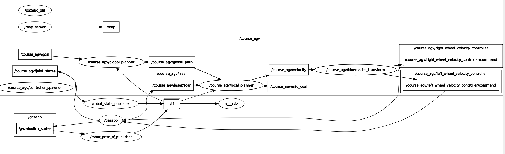

# local planner

dwa 伪代码：

```pascal
function dwa():
  dw = get_dynamic_window()
  for v in dw:
    predict_trajectory()
    cost := calc_cost()
    ▷ update best_velocity
  return best_velocity

function calc_cost(goal,obstacles):
	to_goal_cost = dist(me,goal)
	speed_cost = (max_speed - speed_now)
	ob_cost = dist_to_nearest_obstacle()
	return to_goal_cost + speed_cost + ob_cost
```

* 需要维护goal := mid_pose
* 关于me-obstacle的坐标系
* 何时执行dwa

---

* 有一个class/thread负责整个dwa，与class LocalPlanner分离
* 在获得一个path之后开始执行
* 在到达goal时候结束执行


