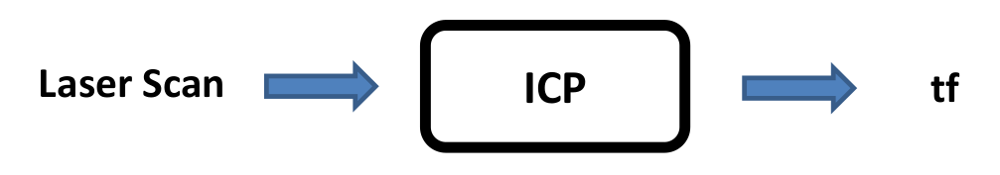
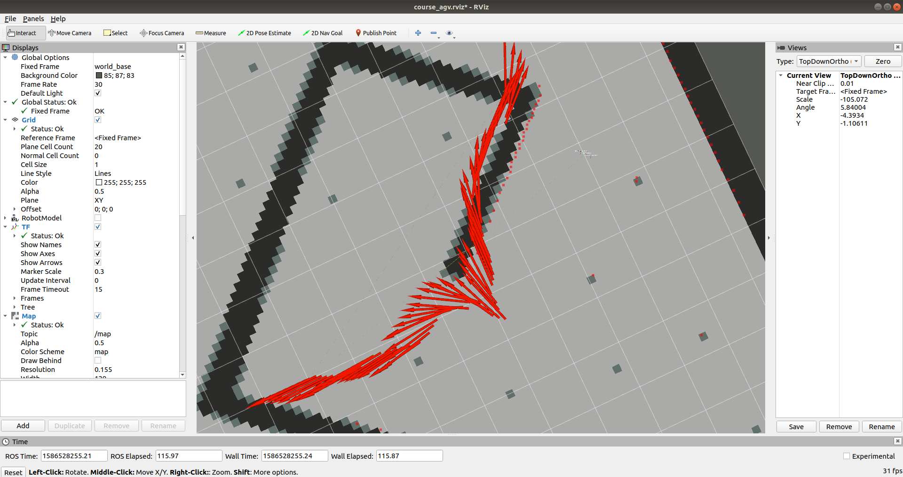

# ICP

*　填写icp.py完成相应功能
*　使用最新的map.png替换原始地图文件
*　推荐使用rosbag调试
  *　播放`rosbag play --clock --pause xxx.bag`
  *　录制 `rosbag record -a`
  *　[网盘链接](https://pan.baidu.com/s/1IhkYNLa2I66FiW-8E8Q_tw)  提取码: gsm5

>  程序结构:

* laserCallback作为接收laser的回调函数,作为主入口
* findNearest 寻找最近邻函数,输入为两个原始点云Matrix
* getTransform计算偏移矩阵,输入为对应点集

> 调试建议:

* 推荐使用numpy,包含大量工具函数
  * 生成array : ones,zeros,identity,arange
  * 矩阵计算 : +-*/,transpose,average,dot,linalg.svd
  * 分片:a[i:i+2,j:j+2]
* 在书写每一条语句,想清楚维数是多少 !!! (numpy shape)