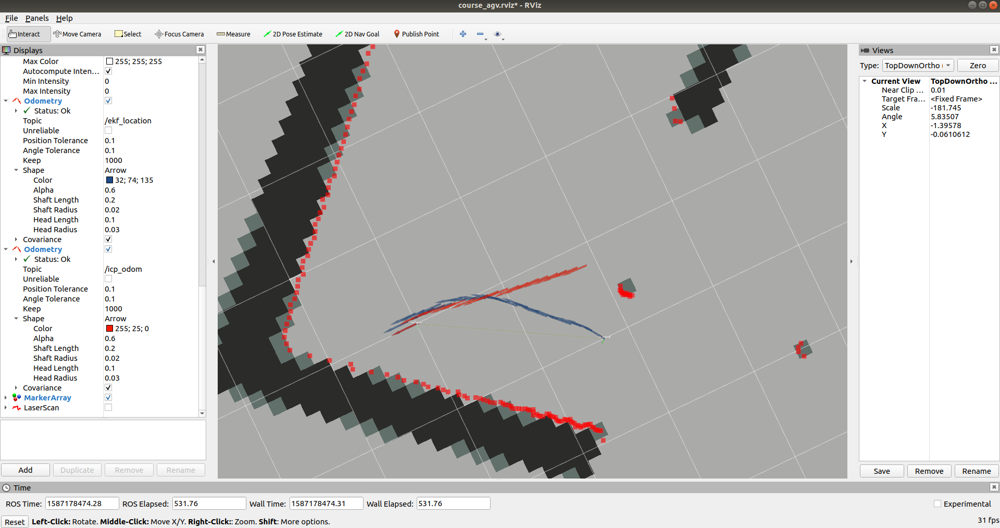

# EKF

* 整理icp.py用于本次实验

* 填写ekf.py以及localization.py两个文件
* 推荐使用rosbag调试
  * rosbag play --clock --pause --rate 0.1 xxx.bag

> 函数说明
* icp整理
  * process函数,输入tar和src,返回变换矩阵
* localization.py
  * calc_odometry : 获取**上周icp**的里程计结果
  * laserEstimation : 模拟当前位置应该出现的laser结果作为地图匹配的tar
  * cal_map_observation : 使用icp计算当前laser与地图匹配的变换矩阵

* ekf.py
  * odom_model : 里程计模型
  * observation_model : 观测模型
  * jacob_f : 里程计模型的jacobian矩阵
  * jacob_h : 观测模型的jacobian矩阵
  * estimate : ekf

> 如何模拟当前位置的laser

* 使用globalplanner使用过的static_map service获取地图
* 对地图上每个障碍物遍历,更新对应角度的激光数据
