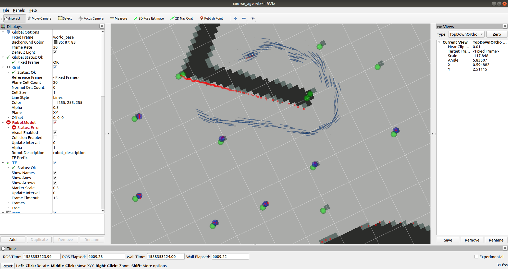

# ekf with landmark



在上一次ekf的基础上，完成一个extraction.py的文件，用于提取landmark

```
Laser Scan -> extraction.py -> Marker Array
extraction + icp + ekf -> localization
```

ekf的相关问题：

1.观测模型以及预测模型

2.如何实现观测（地图匹配）

3.c9代码中ekf的接口有一些小变动

* u从transform matrix变成了[[dx,dy,dyaw]].T
* x状态是[[x,y,yaw]].T